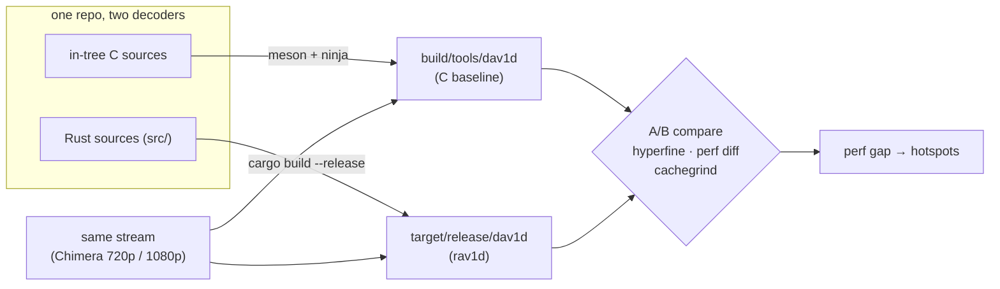

# AGENTS.md — build, test, and measure the performance of `rav1d`

This is the perf-focused operating guide for agents working on `rav1d`. `README.md` and
`CONTRIBUTING.md` cover general contribution; this file is the single place for the
**performance workflow**: how to build the C baseline that lives in this same tree, how to
A/B the two decoders, and which profiling tools to reach for.

If you only remember one thing: **always compare rav1d against the C `dav1d` you built from
this tree, on this machine, decoding the same stream.** Never compare against numbers from a
blog post.

> **Guardrail — the repo is read-only to you.** This is a measurement/optimization
> environment. Do **not** create or update GitHub issues, branches, or pull requests, and do
> not push. Read issues for context, but do not modify remote state unless a human
> explicitly directs it in this session.

---

## 1. What this repo is & the goal

`rav1d` is a Rust port of the C [`dav1d`](https://code.videolan.org/videolan/dav1d) AV1
decoder (`Cargo.toml`: *"Rust port of the dav1d AV1 decoder"*). The north-star goal is
**performance parity with C `dav1d`**.

The tree is a **hybrid**: it contains both the Rust decoder *and* the original C `dav1d`
sources, and **both build**. Performance is measured by decoding the *same* stream with each
binary and diffing.



Background reading: [`README.md`](README.md), [`CONTRIBUTING.md`](CONTRIBUTING.md),
[`doc/retranspile.md`](doc/retranspile.md), the ISRG/Prossimo **rav1d performance** blog
posts and bounty at https://www.memorysafety.org/blog/ (search "rav1d"), and the upstream
`dav1d` project for the reference C implementation.

---

## 2. Prerequisites

Benchmarking assumes a Linux host with profiling enabled (`perf_event_paranoid = -1`,
`kptr_restrict = 0`) and the ability to pin work to a core (`taskset -c <core>`). If
`sudo` is unavailable or interactive-only you cannot change the governor or SMT — plain
core pinning plus hyperfine warmup/repeats is the working protocol in that case.

**VERIFY HOST STATE AT SESSION START — never assume the machine is tuned.** Governor,
SMT, and background load can all change between sessions. Check before any wall-clock
or cycles work:

```sh
cat /sys/devices/system/cpu/cpu0/cpufreq/scaling_governor   # want: performance
cat /sys/devices/system/cpu/smt/control                     # want: off (else adjust thread sweeps)
uptime; ps aux --sort=-%cpu | head -5                       # want: idle
```

If the host is contended or on `powersave`, wall-clock and sampled-cycles numbers are
unreliable (hyperfine σ can reach 9–18% of the mean, vs ~0.2% on a quiet, tuned host);
restrict yourself to deterministic callgrind instruction counts and static analysis
until it clears, and say so in any results you report.

- **Rust toolchain** — pinned by [`rust-toolchain.toml`](rust-toolchain.toml)
  (`nightly-2026-02-05`, component `rustfmt`). `rustup` selects it automatically in-tree.
- **Build deps** — `nasm` (required for the `asm` feature on x86), `meson`, `ninja`, `uv`.
- **Perf/profiling tools** — `perf`, `hyperfine`, `patchelf`, `valgrind`,
  `cargo-flamegraph`, `samply`.

Bootstrap on a fresh host:

```sh
# system packages
sudo apt-get install -y nasm meson ninja-build patchelf valgrind linux-tools-common linux-tools-generic
# cargo-installed tools (land in ~/.cargo/bin, on PATH)
cargo install hyperfine samply flamegraph
# uv (for benchmark.py); see https://docs.astral.sh/uv/ for the installer
```

---

## 3. Building

### rav1d (the Rust decoder)

```sh
cargo build --release        # → target/release/dav1d  (also target/release/seek_stress)
```

`release` uses `codegen-units = 1`, `lto = "fat"`, `panic = "abort"` (see `Cargo.toml`), so
it is slow to build but the only correct build to benchmark.

Profiles (`Cargo.toml`), and when to use each:

| Profile | Use it for |
| --- | --- |
| `release` | **Benchmarking.** Fully optimized. |
| `release-with-debug` | **Profiling.** `release` + `debug = "line-tables-only"` for symbols. |
| `opt-dev` | Day-to-day dev/tests. `opt-level = 1`, debug assertions kept. |
| `checked-release` | Fast-ish build with **all** checks on (`opt-level = 2`). |

```sh
cargo build --profile release-with-debug   # → target/release-with-debug/dav1d  (profiling)
cargo build --profile opt-dev              # → target/opt-dev/dav1d             (tests)
```

Feature flags (`Cargo.toml`; default = `asm`, `bitdepth_8`, `bitdepth_16`, + arm64 asm):

```sh
cargo build --release --no-default-features --features bitdepth_8,bitdepth_16  # Rust-only DSP (no asm)
cargo +stable build --release --lib                                           # library only, stable toolchain
```

Note: `.cargo/config.toml` adds `-Zplt=yes` on x86_64-linux so that calls to the in-binary
`extern "C"` asm (notably the hot `dav1d_msac_decode_*` entropy functions) compile to direct
near calls instead of GOT-indirect ones, matching the C build (~1.3% end-to-end). The flag
is nightly-only — the `+stable` lib build above now fails in-tree. To do a stable build,
temporarily comment out the `rustflags` line in `.cargo/config.toml` (setting `RUSTFLAGS`
in the environment also works, since it overrides the config's target rustflags entirely).

- `asm` on x86 **requires `nasm`**. `--no-default-features` drops asm and forces the Rust
  fallback DSP — useful for attributing Rust-vs-asm cost (see §5).

### C `dav1d` (the baseline — the apples-to-apples comparison target)

Build the C sources still in this tree with Clang, via meson + ninja. Check the `LLVM
version` reported by `rustc -vV` before configuring: if the host provides multiple Clang
versions, use the Clang major version that matches Rust's LLVM, or the numerically closest
available version when there is no exact match. Meson caches the selected compiler, so use a
fresh build directory when changing compilers; `--reconfigure` alone will not switch it.

```sh
# Example when rustc uses LLVM 22:
CC=clang-22 meson setup build -Dtest_rust=false
ninja -C build
# → build/tools/dav1d   and   build/src/libdav1d.so.*
```

`build/tools/dav1d` is the binary you A/B rav1d against.

---

## 4. Testing (correctness)

Correctness uses the original meson test suite, driven by
[`.github/workflows/test.sh`](.github/workflows/test.sh). **Build rav1d first** — the tests
do not build it for you. The `dav1d-test-data` submodule (~763 `.ivf` streams) ships in-tree.
Note: `test.sh` reconfigures `build/` with `-Dtest_rust=true`; that doesn't change the C
`build/tools/dav1d` binary, but if you want the build dir back in its baseline-only state
afterwards, rerun `meson setup build -Dtest_rust=false --reconfigure`.

```sh
cargo build --release
.github/workflows/test.sh -r target/release/dav1d
```

Flags (from `test.sh`):

| Flag | Meaning |
| --- | --- |
| `-r PATH` | rav1d binary to test (`-Dtest_rust_path`). |
| `-s PATH` | `seek_stress` binary → adds the seek-stress suite (e.g. `target/release/seek_stress`). |
| `-t MULT` | Timeout multiplier (raise for debug builds). |
| `-f DELAY` | Frame delay → runs with 2 threads. |
| `-n` | Negative strides (1 thread). |
| `-d` | Debug build of the meson-side test harness. |
| `-w WRAPPER` | Run under a wrapper (e.g. QEMU for cross-arch). |

Suites run: `testdata-8`, `testdata-10`, `testdata-12`, `testdata-multi`, plus
`testdata_seek-stress` when `-s` is given.

`test.sh` sets `RUST_BACKTRACE=1` **and** `RUST_LIB_BACKTRACE=0`. The second is important:
`rav1d` calls `Backtrace::capture()` on every `DisjointMut` index; with `RUST_LIB_BACKTRACE`
unset it would capture a full backtrace each time and make tests extremely slow. Keep it `0`
unless you actually need library backtraces.

### Argon vectors (extra coverage)

The Argon AV1 conformance vectors give broad extra coverage. `dav1d_argon.bash` defaults
its `-a` search to `tests/argon`, so if the vectors are already unpacked there, just run:

```sh
tests/dav1d_argon.bash -d target/release/dav1d -j $(nproc)
```

To (re)fetch on a fresh host, mirror
[`build-and-test-x86-extra.yml`](.github/workflows/build-and-test-x86-extra.yml) — the ~6.5 GB
zip from the AOM public S3 bucket, MD5-checked, unpacked into `tests/argon/`:

```sh
BASE=https://aom-cwg-av1-argon-streams-public.s3.us-east-1.amazonaws.com
ZIP=argon_coveragetool_av1_base_and_extended_profiles_v2.1.1.zip
curl -sO "$BASE/$ZIP" && curl -sO "$BASE/$ZIP.md5sum"
md5sum --check "$ZIP.md5sum"
unzip -q "$ZIP" && mv argon_coveragetool_av1_base_and_extended_profiles_v2.1 tests/argon && rm "$ZIP"
```

`dav1d_argon.bash` flags: `-d <dav1d>` (default `tools/dav1d`), `-a <argondir>` (default
`tests/argon`), `-g <filmgrain>`, `-c <cpumask>`, `-t <threads>`, `-j <parallel jobs>`.
Skips large-scale-tile and stress dirs by default; pass dir names to restrict the run.

### checkasm (asm-vs-Rust parity)

```sh
meson test -C build --suite checkasm     # correctness: asm kernels vs Rust fallback
```

### Lint/format gates

```sh
cargo clippy -- -D warnings
cargo fmt --check
```

Validate the non-asm paths with a `--no-default-features` build run through the same tests.

---

## 5. Measuring performance (the centerpiece)

**Golden rule:** A/B against the *local* C baseline — same stream, same `--threads`, both
`release` builds, on the pinned machine (§6). Report the ratio, not absolute seconds.

**The asm is not a suspect — don't spend time on it.** The hand-written SIMD kernels are
the *same source files* C `dav1d` uses, assembled by the same `nasm` from this tree, and
both decoders select the same kernel tier via the same CPU detection. Verified directly:
`perf` shows identical instruction counts for the same kernel symbols in both binaries
(e.g. 232.7M for the top mc kernel on the Chimera run). The performance gap therefore
cannot live *inside* a DSP kernel. It can only live in (a) how calls to the asm are
*emitted* — the GOT-indirection issue already fixed by `-Zplt=yes`, (b) what the Rust
driver code does *between* kernel calls, and (c) the pure-Rust fallback DSP, which is only
used with `--no-default-features`. `checkasm --bench` compares asm against the Rust
fallback — use it to study the fallback, not to re-validate the asm.

**Operational constraint: do not rewrite, retune, or otherwise modify the assembly.** rav1d
and dav1d share it version-for-version; keeping it identical is what makes the A/B
meaningful, and any divergence would turn a controlled comparison into two different
programs. Two corollaries follow:

- **Tooling that cannot process the asm is correctly scoped, not compromised.** `llvm-bolt`,
  for instance, cannot reconstruct the hand-written computed jumps and produces a
  segfaulting binary unless restricted with `--funcs='^_R.*'` (Rust-mangled symbols only).
  That restriction is the *right* configuration, not a workaround to be lifted — the asm it
  skips is at parity by construction.
- **The gap is concentrated in the Rust half, so it is larger there than end-to-end numbers
  suggest.** Asm accounts for roughly 40–50% of cycles and contributes ~0 to the delta, so a
  +4.8% whole-program gap implies something closer to a ~9% gap in the driver code we
  actually control. Size optimization budgets against the Rust half, not the whole program.

### Canonical inputs

The two Chimera streams used by CI and `benchmark.py` (Netflix opencontent S3 bucket):

```sh
mkdir -p benchmarks
BASE=http://download.opencontent.netflix.com.s3.amazonaws.com/AV1/Chimera/Old
curl -sL -o benchmarks/chimera-8bit-720p.ivf  $BASE/Chimera-AV1-8bit-1280x720-3363kbps.ivf
curl -sL -o benchmarks/chimera-10bit-1080p.ivf $BASE/Chimera-AV1-10bit-1920x1080-6191kbps.ivf
```

Sweep threads across 1 / half the cores / all cores (1 thread gives the cleanest
attribution; the top end exercises the whole machine — count hardware threads with
`nproc` and note whether SMT is on, since it changes what "all cores" means).

### hyperfine A/B (start here)

```sh
hyperfine --warmup 3 \
  -L bin target/release/dav1d,build/tools/dav1d \
  '{bin} -q -i benchmarks/chimera-8bit-720p.ivf -o /dev/null --threads 1'
```

### benchmark.py (build + benchmark a commit, or bisect a range)

`uv` script; builds both rav1d and C dav1d, drives `hyperfine --warmup 3`
(`--limit 1000 --threads {N}`), and caches artifacts/results in `benchmarks/`. Needs
`hyperfine`, `patchelf`, and `uv` on PATH.

```sh
./benchmark.py --threads 1 --threads 8 --threads 16      # HEAD vs its C baseline
./benchmark.py --threads 1 --commit <old>..<new>         # bisect a range (single thread only)
```

Notes: it downloads **only** the 8-bit 720p stream, decodes with `--limit 1000` frames, uses
`target/<host-target>/release/dav1d`, and for *older* commits it rewrites `rust-toolchain.toml`
and cherry-picks an arm fix — don't be surprised by the transient git state it creates.

### perf stat (cheap first look at where cycles go)

```sh
perf stat -r5 -- target/release/dav1d -q -i benchmarks/chimera-8bit-720p.ivf -o /dev/null --threads 1
```

Watch cycles, instructions, IPC, cache-misses, branch-misses. Single-threaded for clean
attribution. (CI uses `perf stat -r3`.)

### Available perf counters (example: AMD Zen)

With unrestricted profiling (`perf_event_paranoid = -1`), useful counters to reach for
(exact PMU event names vary by vendor and generation — check `perf list` on your host):

- **Core events / metrics** — `cycles`, `instructions` (→ IPC), `branches`, `branch-misses`,
  `stalled-cycles-frontend`; software events `page-faults` / `minor-faults` / `major-faults`,
  `context-switches`, `cpu-migrations`, `task-clock`.
- **Cache & TLB** (legacy aliases) — `L1-dcache-loads`, `L1-dcache-load-misses`,
  `l1-icache-load-misses`, `dtlb-load-misses`, `itlb-load-misses`, `LLC-loads`,
  `LLC-load-misses`. `perf stat -d` adds the L1/LLC breakdown; `-dd` / `-ddd` add more.
- **AMD Zen named PMU events** (see `perf list`) — dispatch/stall analysis
  (`de_no_dispatch_per_slot.backend_stalls`, `de_dispatch_stall_*`), retire (`ex_ret_brn`,
  `ex_ret_brn_ind_misp`), L2 (`l2_cache_req_stat.*`, `l2_request_g1.*`), and the L3
  group (`l3_cache_accesses`, `l3_misses`, `l3_read_miss_latency*`) — worth watching on
  large-L3 parts. On AMD, precise sampling maps to IBS (`ibs_op//p`, `perf mem`).
- **Metric groups** (`perf stat -M <group>`) — `backend_bound` / `frontend_bound` (a
  topdown-style split), plus `l1d_miss_rate`, `llc_miss_rate`, `dtlb_miss_rate`,
  `itlb_miss_rate`, `insn_per_cycle`.

```sh
# topdown-style: frontend- or backend-bound?
perf stat -M backend_bound,frontend_bound -- target/release/dav1d -q -i STREAM -o /dev/null --threads 1
# L3 behaviour + named AMD events
perf stat -e cycles,instructions,l3_cache_accesses,l3_misses,l2_cache_req_stat.ic_dc_miss_in_l2 \
  -- target/release/dav1d -q -i STREAM -o /dev/null --threads 1
```

Asking for more events than physical counters causes **multiplexing** — perf prints a per-event
enable fraction like `(53.77%)` and scales the count. Keep event lists short, or make several
focused passes, when you need exact numbers.

### perf record / report (find the hot functions)

```sh
cargo build --profile release-with-debug
perf record --call-graph dwarf -- \
  target/release-with-debug/dav1d -q -i benchmarks/chimera-8bit-720p.ivf -o /dev/null --threads 1
perf report
```

### perf diff (the core "where do we spend *more*" workflow)

new-rav1d vs old-rav1d:

```sh
perf record -o perf.rav1d -- target/release/dav1d      -q -i STREAM -o /dev/null --threads 1
perf record -o perf.dav1d -- build/tools/dav1d         -q -i STREAM -o /dev/null --threads 1
perf diff perf.dav1d perf.rav1d | head -n 100
```

(This mirrors the self-hosted CI job in `build-and-benchmark-x86.yml`, which diffs the PR
build against `origin/main`.)

**Caveat:** `perf diff` only matches by symbol name, so it works for rav1d-vs-rav1d but is
nearly useless for rav1d-vs-C (`rav1d::decode::decode_b` never matches `decode_b`). For the
cross-decoder comparison, run `perf report --stdio` on each and compare
*percent × total event count* per function manually (both totals are printed in the report
header). Two techniques that paid off:

- **Sum the `callq`-attributed samples per function** to spot call-boundary overhead:
  `perf annotate --stdio -s SYMBOL | grep callq | awk '{s+=$1} END {print s}'`.
  rav1d's `decode_b` had 19.5% of its cycles on call instructions vs 5.7% for C's — that
  pointed straight at the GOT-indirection issue fixed by `-Zplt=yes` in
  `.cargo/config.toml`.
- **Confirm "overhead" hypotheses with callgrind per-function instruction counts before
  patching.** Cycles piled on a loop by `perf annotate` do *not* mean the loop executes too
  many instructions — two guard-hoisting patches that looked obvious in annotate turned out
  instruction-neutral or worse under callgrind and were reverted (see the pitfalls list
  below).

### Flamegraphs & samply (interactive)

```sh
cargo flamegraph --profile release-with-debug -- -q -i STREAM -o /dev/null --threads 1
samply record         target/release-with-debug/dav1d -q -i STREAM -o /dev/null --threads 1
```

### Deterministic instruction counts (sub-noise wins)

When a change is smaller than benchmark noise, use valgrind for exact, repeatable counts:

```sh
valgrind --tool=cachegrind target/release/dav1d -q -i STREAM -o /dev/null --threads 1 --limit 50
valgrind --tool=callgrind  target/release/dav1d -q -i STREAM -o /dev/null --threads 1 --limit 50
```

### Isolate a single DSP kernel

```sh
build/tests/checkasm --bench          # micro-bench each kernel (asm vs Rust fallback)
```

Use this when the gap points at one DSP function rather than the decoder as a whole.

### Attributing Rust vs asm

Build `--no-default-features` (Rust-only DSP) and benchmark it against the default (asm)
build. The delta is what the hand-written asm buys — and where a slow Rust fallback or asm
call-indirection shows up.

### Measurement pitfalls & red herrings (learned the hard way)

Each of these cost real time once. Check the list before trusting a profile or writing a
patch:

- **The `instructions` sampling event lies about hot lines.** It piles samples onto
  retire bubbles, so per-line percentages are *not* executed-instruction proportions. Two
  `movups` outgoing-arg stores showed 74% of `recon::mc`'s instruction samples; the
  `cycles` event and callgrind both showed nothing there. Use `perf annotate -e cycles`
  for time and callgrind for counts; never patch off an `instructions`-event annotate.
- **Instruction-level inefficiency at a call boundary can be cycle-free.** LLVM
  materializes 16-byte by-value FFI args (`WithOffset`) as two 8-byte stores + one
  16-byte `movups` reload — a guaranteed store-forwarding failure, ~1.7M×/200 frames.
  It costs zero wall time: the value feeds only outgoing arg slots the asm callee never
  reads, so the latency hides in the out-of-order window. Before any call-ABI surgery,
  check whether the marshaling-heavy drivers are already at *cycle* parity with C
  (when we measured, they were).
- **Hoisting `DisjointMut` guards out of loops doesn't help.** Tried twice (cdef
  `backup2x8`, `lf_mask`): instruction counts came out neutral or *worse* (+6% in one
  case) — LLVM already hoists what matters, and restructuring can defeat its other
  optimizations. Bounds/guard checks are not where the gap is.
- **callgrind mis-attributes the C build's asm.** Perf events and callgrind costs for
  the hand-written asm regions in `libdav1d.so` get folded into the nearest *named* C
  symbol (e.g. inflating `mc.isra.0` to 515M instr). Also, valgrind's synthetic CPUID
  changes the DSP tier the decoders select. For cross-decoder attribution use bare-metal
  `perf record`; keep callgrind for exact counts *within* rav1d.
- **Rust and C inline differently — compare symbol *clusters*, not single symbols.**
  rav1d's `create_lf_mask_inter` looked much worse than C's until the inlined-out
  `mask_edges_inter`/`decomp_tx` were summed on both sides. Sum the whole cluster before
  declaring a delta.
- **PGO buys almost nothing in this codebase (+0.5% measured).** `codegen-units = 1` + fat LTO already give
  LLVM the whole-program view, and branch misses are already below C's. Not worth the
  two-stage build; revisit only after large source-level wins, or with BOLT.
- **Wall-clock can't see below ~0.3%** (single-run σ ≈ 0.2% on a 1.4 s run). Gate
  sub-noise changes on callgrind icounts + cycles-profile percentages, in that order,
  before hyperfine.
- **The benchmark window changes function weights — validate where the function has
  weight.** Function shares differ up to ~3× between `--limit 1000` (the canonical
  hyperfine window) and the full Chimera stream: `cdef_brow` is ~1.8% of cycles in the
  first 1000 frames but 5.32% full-stream. A win in a late-stream-heavy function can be
  invisible in the limit-1000 wall clock; measure such functions on the full stream or a
  late window.
- **Disassembly guard-site counts don't predict cost.** A bounds-check-elimination patch
  that *increased* `panic_bounds_check` call sites 6→9 (and code size) still cut the
  function's executed instructions by 22% (`decomp_tx`); another that
  removed 39/49 sites won only −1%. Count executed instructions with callgrind; never
  gate on site counts or code size.
- **Bounds/guard-elimination techniques are pattern-local — measure every single
  instance.** Across one sweep of `lf_mask`/`decode.rs`: up-front row re-borrows won in
  `decomp_tx` (−22%) but the sibling `masks[]` window pre-slicing regressed in 3
  independent attempts; a hoisted invariant assert won in `mask_edges_inter` (−1%) but
  regressed in `mask_edges_chroma` (+7%) and `mask_edges_intra`; a `CaseSet::many`→
  `one`+`one` unroll won in `read_tx_tree` (−1.4%) while a recursion-arg merge regressed
  twice. No technique generalizes; the same transformation flips sign between
  neighboring functions. One md5-verified callgrind A/B per instance, revert anything
  flat or worse.
- **An instruction-count win is not yet a cycle win.** Three separate call-boundary
  instruction reductions (FFI-arg marshaling, DSP-call bounds checks, dead outgoing-arg
  stores) measured cycle-neutral — OoO execution hid them all. Removed instructions only
  pay when they sit on dependence chains or saturate issue width; treat icount-gated
  patches as "gap-narrowing, cycle effect pending" until cycles/wall confirm on a quiet
  host.
- **An instruction-count win can be an outright cycle *loss*.** The strongest case: hoisting
  a per-element `DisjointMut` guard out of the `lf_mask` `level_cache` loops removed **45M
  instructions (−1.6% of program)** and drove the function *below* its C counterpart, yet
  cost ~1% cycles in both layouts. `stalled-cycles-frontend` rose 15.7% (+13.0M cycles,
  more than the whole regression) because `#[inline(always)]` × 4 call sites × a ×4-unrolled
  body grew two hot functions 13.2%. **Gate any "now LLVM can unroll it" patch on
  `stalled-cycles-frontend` and hot-function code size before spending a cycles run.**
- **Code layout is worth ±1.5–2% cycles on the canonical cell** — more than most remaining
  per-function deltas. A change can be intrinsically good and still regress the shipping
  build, or vice versa. **Any sub-2% cycle claim needs alignment-controlled builds of both
  sides** (`-Zmin-function-alignment=64`, and ideally a third point at `=32`): consistent
  sign across layouts means a source effect, a sign flip means scatter. Note the flag is not
  a deployment win in itself (parent-vs-parent it measured +1.7%).
- **Episode drift.** Separate `hyperfine`/`perf stat` invocations of the *same* binary differ
  by up to ~1.5% cycles even on a tuned host. Only **interleaved order-balanced pairs**
  (A B, B A, …, 25–30 pairs, paired statistics) are trustworthy below 1%.
- **Cross-binary driver-vs-kernel cycle shares are biased by call-boundary smear.** rav1d's
  asm looks ~18% cheaper and its drivers ~32% dearer than C's, for identical kernels. It is
  not symbol resolution (`perf script -F symoff` puts every sample inside the real symbol);
  the bias tracks call frequency — `wiener_filter7` (few calls, big work) is at exact parity
  while ipred kernels read −80%. **Use callgrind icounts for cross-binary attribution and
  reserve hardware cycles for same-binary A/B.**
- **The legacy `cache-misses` sampling event lies about miss *location* on Zen 5** — it put
  25.8% of program misses inside an L1-clean 2.3 KB driver body. Use IBS (`perf mem record` /
  `ibs_op//p`).
- **Branch sampling needs `-j any,u`, not `-b`.** On this Zen 5 host `perf record -b` yields
  no branch records while `-j any,u` works (`amd_lbr_v2`, 16 entries). A wrong negative here
  cost a whole BOLT evaluation round.

---

## 6. Benchmark stability / reproducibility

**On an already-tuned machine** (governor `performance`, SMT off — verify per §2), the
working protocol is simply:

```sh
taskset -c 2 <benchmark command>     # pin to one (non-0) core
```

If you have sudo and the machine isn't tuned yet:

```sh
sudo cpupower frequency-set -g performance          # or: echo performance | sudo tee /sys/devices/system/cpu/cpu*/cpufreq/scaling_governor
echo off | sudo tee /sys/devices/system/cpu/smt/control   # disable SMT for stable core behavior
taskset -c 0 nice -n -5 <benchmark command>          # pin to one core, raise priority (nice needs sudo)
```

Always `--warmup` (hyperfine) or discard the first run — caches need to warm up.

**Never benchmark while anything heavy runs** — a concurrent `cargo build`/`ninja` (even
pinned elsewhere) pollutes the shared L3; we have seen it produce ±8% outliers in the C
baseline. Finish builds first; keep hyperfine runs exclusive.

**No-sudo / noisy fallback.** Lean on statistics and determinism: many hyperfine runs with
warmup, and cachegrind/callgrind for exact instruction counts that don't care about
frequency scaling.

With single-run σ ≈ 0.002–0.004 s on a 1.4 s run (≈0.2%), wall-clock A/B cannot resolve
changes below ~0.3%; anything smaller needs callgrind instruction counts (but see the §5
caveat: instruction counts don't capture stall/latency effects, so a change can be
icount-neutral and still matter — or icount-positive and still be useless).

**Absolute numbers don't transfer.** Your machine will not reproduce the absolute seconds
in the memorysafety.org blog posts (different CPU). This is expected — only the **ratio to
the local C baseline** is meaningful. Never chase a published figure.

---

## 7. Reference

- [`README.md`](README.md) — general build/test, supported targets, API usage.
- [`CONTRIBUTING.md`](CONTRIBUTING.md) — contribution process.
- [`doc/retranspile.md`](doc/retranspile.md) — re-transpiling `fn`s after C changes.
- CI workflows: [`.github/workflows/test.sh`](.github/workflows/test.sh),
  [`build-and-benchmark-x86.yml`](.github/workflows/build-and-benchmark-x86.yml),
  [`build-and-test-x86.yml`](.github/workflows/build-and-test-x86.yml).
- rav1d performance blogs + bounty: https://www.memorysafety.org/blog/.
